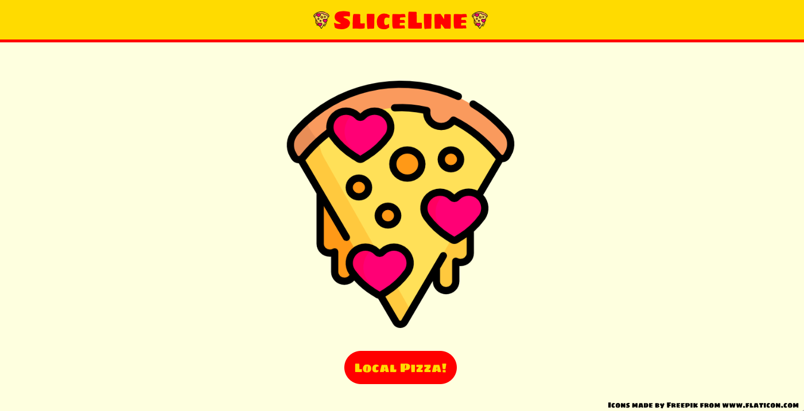

# SliceLine

[Live site](https://nllevin.github.io/sliceline/)

## Inspiration

The only thing worse than being hungry when you're out of town is not knowing where to get pizza! That's why I created SliceLine, an app that shows you nearby pizzerias.

## Implementation

### Technologies Used

I built this app using React and the Foursquare API. By using `Geolocation.watchPosition()`, the app determines the user's position. Through use of the `axios` HTTP client, this location information is then used to query the Foursquare API for nearby pizzerias. Finally, for each pizzeria, the Foursquare API is queried one more time in order to retrieve more detailed information about that particular venue.

### Caching

The terms of service for the Foursquare API require that data be deleted when a user closes the app; for uncredentialed users, stale data must not be cached for more than three hours. I used `sessionStorage` to meet these requirements, since `sessionStorage` automatically discards data when the browser is closed. In addition, I stored a timestamp in `sessionStorage` to ensure that stale data gets refreshed at least as frequently as every three hours.

## Attribution

This project was bootstrapped with [Create React App](https://github.com/facebook/create-react-app).